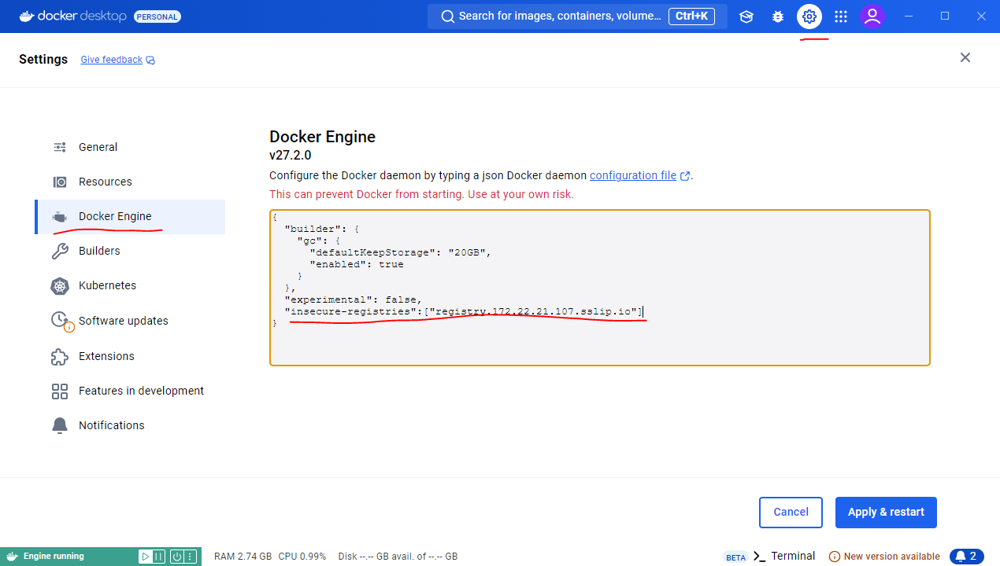

# Deploy DAD Project

**NOTE**: To run most of the command present in this tutorial we need to either be connected to our school network or use its VPN.

To deploy the project to our Kubernetes cluster we will need docker and `kubectl` (the Kubernetes cli).

## Install `kubectl`

Follow these steps to install `kubectl`

### Windows WSL | Linux

Download the binary:

```bash
 curl -LO "https://dl.k8s.io/release/$(curl -L -s https://dl.k8s.io/release/stable.txt)/bin/linux/amd64/kubectl"
```

Move binary to the sudo controller folder:

```bash
sudo install -o root -g root -m 0755 kubectl /usr/local/bin/kubectl
```

Check:

```bash
kubectl version --client
```

### MacOS

Download the binary:

```bash
 curl -LO "https://dl.k8s.io/release/$(curl -L -s https://dl.k8s.io/release/stable.txt)/bin/darwin/amd64/kubectl"
```

Move binary to the sudo controller folder:

```bash
chmod +x ./kubectl
sudo mv ./kubectl /usr/local/bin/kubectl
sudo chown root: /usr/local/bin/kubectl
```

Check:

```bash
kubectl version --client
```

### Kubeconfig

Add the config file you got via email on to `~/.kube/config` and test you connection to the cluster.

```bash
kubectl get pods
```

## Prepare the Deployment

This tutorial assumes that we have our project in the following folder structure:

```bash
./                  -> Project Base
├── deployment      -> deployment files (Dockerfiles and Kubernetes Resources)
├── laravel         -> Laravel Project Root
├── vue             -> Vue Project Root
|── websockets      -> Node Web Sockets Project Root
```

### Tooling

The repository associated with these tutorials has all the commands defined in a `justfile`. [Justfile](https://github.com/casey/just) is a simplified version of a `Makefile` and we need to install if (instructions on the github page) we want to use it. Still on this tutorial we will see all the commands so that we can run them manually if we want.

Each group has access to their own namespace on kubernetes but they need to register the images and deployments with the proper reference to the group. That reference has the format **dad-group-X**, where X is the group number.

### Preparing Laravel

In the case of Laravel we need to make sure the database credentials and the SESSION_DOMAIN (for Sanctum) variables on the .env file are properly configured. Since we want to be able to run them locally we use the Docker file to change those variables. The only one that we must change is the group and that can be done using this flag for the docker build commmand:

```bash
-build-arg GROUP=dad-group-X
```

### Preparing Vue

In Vue's case we can take advantage of the `.env` files support of Vite to create a `.env` and a `.env.production` files with the following variables (again X to be replaced with the group number):

```ini
# .env
VITE_API_DOMAIN=localhost:8085
VITE_WS_CONNECTION=ws://localhost:8086


# .env.production
VITE_API_DOMAIN=api-dad-group-X.172.22.21.101.sslip.io
VITE_WS_CONNECTION=ws://ws-dad-group-X.172.22.21.101.sslip.io
```

## Deploy the code

To deploy our code to the cluster we need to build or container images locally, and push them to the container registry, that in our case lives at `registry.172.22.21.107.sslip.io`.

Present in the repository under the [code](https://github.com/ricardogomes/DAD-2024-25-Tutorials/tree/main/code) folder is one called `deployment`. We are going to need those files.

Assuming we have a deployment folder in the same place as this tutorial repository we can run the next commands from the base of the full project. But check each command for the placement of the files and folders and change accordingly.

One important **NOTE** is that Kubernetes will depend on us naming the versions of our apps to re-deploy them when we change our code, so keep in mind that we need to bump the version each time we want to push a new version of our applications.

### Configure Docker

Our Docker Registry does not use HTTPS so we ned to inform Docker that this registry is only available on port 80.

This is the configuration we need (this is a JSON property to be included into either existing configuration or a new JSON config by wrapping it in { }):

```json

    "insecure-registries" : [ "registry.172.22.21.107.sslip.io" ]

```

On Windows and MacOS the simples way is to configure this via Docker Desktop.



On linux we can edit the file directly via `sudo nano /etc/docker/daemon.json` and restart the service via `sudo systemctl restart docker`.

### Push Images to Container Repository

Build the Laravel Image (replace group with your group id - dad-group-X and the version with the current version - 1.0.0):

```bash
docker build -t registry.172.22.21.107.sslip.io/{{group}}/api:v{{version}} \
    -f ./deployment/DockerfileLaravel ./laravel \
    --build-arg GROUP={{group}} --debug
```

Push the Laravel Image (replace group with your group id - dad-group-X and the version with the current version - 1.0.0):

```bash
docker push registry.172.22.21.107.sslip.io/{{group}}/api:v{{version}}
```

Build the Vue Image (replace group with your group id - dad-group-X and the version with the current version - 1.0.0):

```bash
docker build -t registry.172.22.21.107.sslip.io/{{group}}/web:v{{version}} -f ./deployment/DockerfileVue ./vue
```

Push the Vue Image (replace group with your group id - dad-group-X and the version with the current version - 1.0.0):

```bash
docker push registry.172.22.21.107.sslip.io/{{group}}/web:v{{version}}
```

Build the Node WebSockets Image (replace group with your group id - dad-group-X and the version with the current version - 1.0.0):

```bash
docker build -t registry.172.22.21.107.sslip.io/{{group}}/ws:v{{version}} -f ./deployment/DockerfileWS ./websockets
```

Push the Node WebSockets Image (replace group with your group id - dad-group-X and the version with the current version - 1.0.0):

```bash
docker push registry.172.22.21.107.sslip.io/{{group}}/ws:v{{version}}
```

### Deploy Resources to Kubernetes Cluster

Before we can publish our Kubernetes resources we need to replace the string 'dad-groupx' in each file with our actual group (group99 is used in the code examples).

For Linux | WSL :

```bash
find ./deployment -name "*.yml" -exec sed -i "s/dad-groupx/dad-group99/g" {} +; \
```

For MacOS:

```bash
find ./deployment -name "*.yml" -exec sed -i '' "s/dad-groupx/dad-group99/g" {} +; \
```

We can now deploy our resources:

```bash
kubectl apply -f deployment/
```

Check the deployment using:

```bash
kubectl get pods
```

Container may take a bit to get to the `healthy` state but after that would should be able to reach your application at:

- VUE: [http://web-dad-group-x-172.22.21.101.sslip.io](http://web-dad-group-x-172.22.21.101.sslip.io)
- Laravel: [http://api-dad-group-x-172.22.21.101.sslip.io](http://web-dad-group-x-172.22.21.101.sslip.io)

## Running commands

We sometimes need to run commands on the containers running in the cluster, one example are the Laravel commands (like migrate), we can by using these commands (X is the group number):

```bash

# get pod name
kubectl get pods -n dad-group-X -l app=laravel-app


kubectl -n dad-group-X exec -it <pod-name> -- php artisan migrate:fresh --seed

```

To redeploy the application stack you can run:

```bash

kubectl delete -f deployment
kubectl apply -f deployment

```
