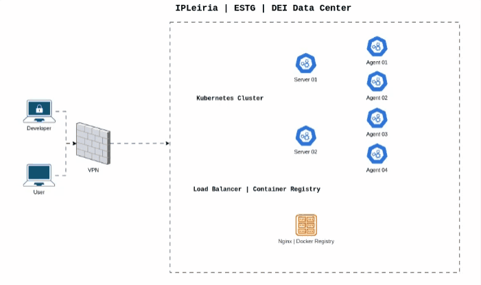

---
# https://vitepress.dev/reference/default-theme-home-page
layout: home

hero:
  name: "Project Tutorials"
  text: "Tutorials related to the DAD 2024/25 course"
  actions:
    - theme: brand
      text: DAD Project Deploy
      link: /deploy
    - theme: alt
      text: DAD Project Troubleshooting
      link: /troubleshooting
    - theme: alt
      text: Laravel Sail
      link: /sail
---

In this documentation we have a set of tutorials to help us implement the 2024/25 Project.

<h2 style="font-size:1.8em; font-weight:bold; margin: 30px 0; clear:both;"> Infrastructure </h2>

This is the infrastructure overview:

These are the suggested steps:

Follow the tutorials to connect to the provided Kubernetes Cluster and set up the Project. Happy Coding.

