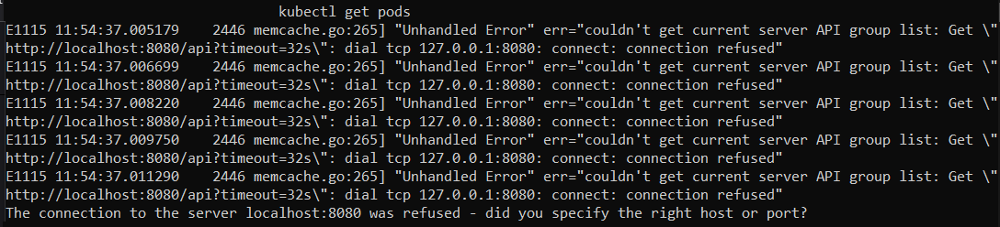
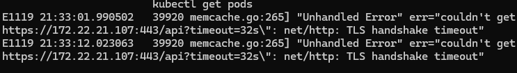
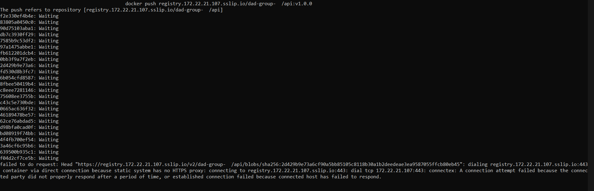
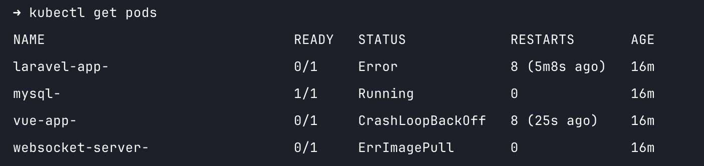

# Troubleshooting

Given the nature of this project / infrastructure there are several situations that can arise that prevents the proper publishing of this project. Some seem to depend our own development environment and some depend on our workflow.

## `kubectl` Known Issues

These issues where reported by multiple students, some are fixable and for some we currently only have a workaround.

### kubectl connecting to 127.0.0.1 or localhost



This means that the kubectl utility is not reading the config file you received via email. There are 2 options to solve this:

- make sure you named your config as ~/.kube/config (without the yml extension, the email was sent with the extension in order to not get blocked by the spam filters)
- force the config by exporting the [KUBECONFIG](https://kubernetes.io/docs/concepts/configuration/organize-cluster-access-kubeconfig/#the-kubeconfig-environment-variable) env variable

```bash
# in the default location
export KUBECONFIG=~/.kube/config

# in another location
export KUBECONFIG=<full path to the config file>

```

### kubectl timeout



This issue is one of the ones that we don't have a proper solution for it. We do have a workaround.

Copy the .kube folder to your user folder on the Windows side (`C:/Users/<user>`).

This utility is used to push Kubernetes resources to our cluster, and we only need the yaml files inside the `deployment` folder on the tutorial repository. Copy those files to anywhere on Windows, make sure you have the proper versions of the apps, and run the apply command.

**NOTE:** untested solution

Run this inside WSL ([more info](https://stackoverflow.com/questions/59958274/unable-to-connect-to-the-server-net-http-tls-handshake-timeout)):

```bash

sudo ip link set dev eth0 mtu 1350

```

### `docker push` using HTTPS



Even with the `insecure-registries` configuration on Docker the docker pull command still tries to communicate with the registry using HTTPS, which we cannot set up due to the lack of valid certificates.

Unfortunately we still haven't got a solution to this one. The workaround that is working for some groups is having another member of the group run this commands.

One option, **only for Windows 11** users, that is not guaranteed to work but could solve some issues is to set up a file called `.wslconfig` on your Windows user folder with the following content:

```ini
[wsl2]
dhcp=true
dnsTunneling=true
networkingMode=mirrored

```

### Pod errors when `docker build` was ran on Apple Silicon Macs



The `docker build` command on Apple Silicon Macs will build the images for the ARM architecture, and the Kubernetes cluster is on AMD/64.

We need to add the parameters to the docker build commands: `--platform linux/amd64`.

Keep in mind that the simplest way to update images is to bump the version number on both the docker commands and the kubernetes deployment files.
