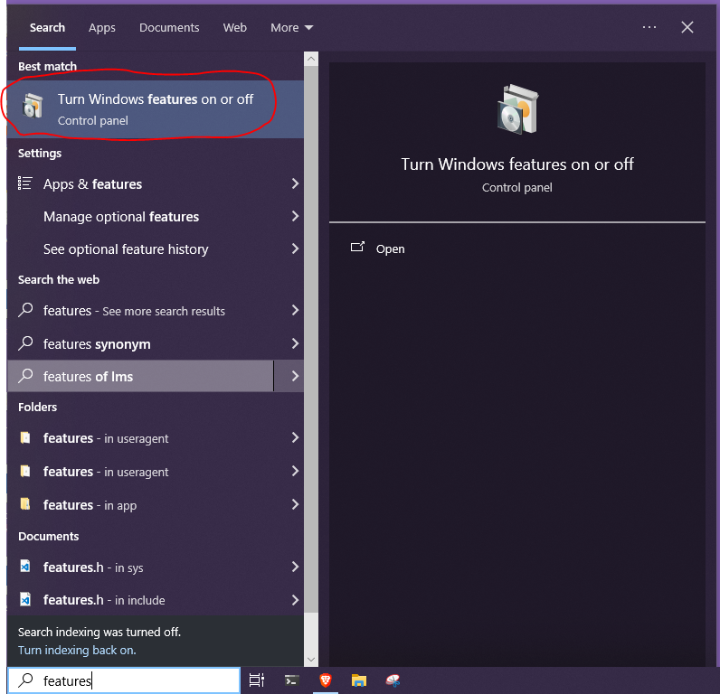
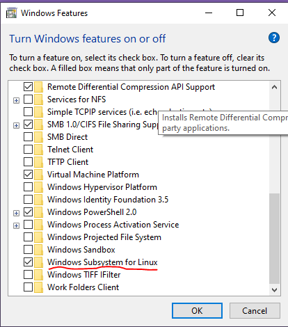
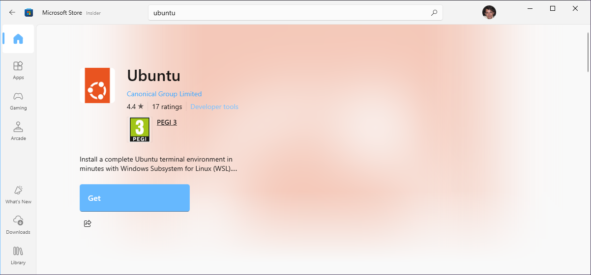
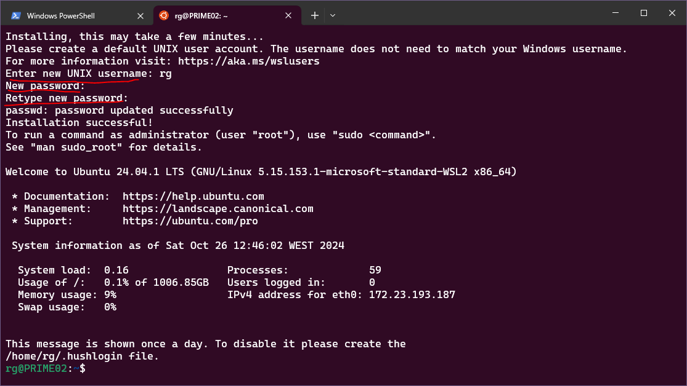
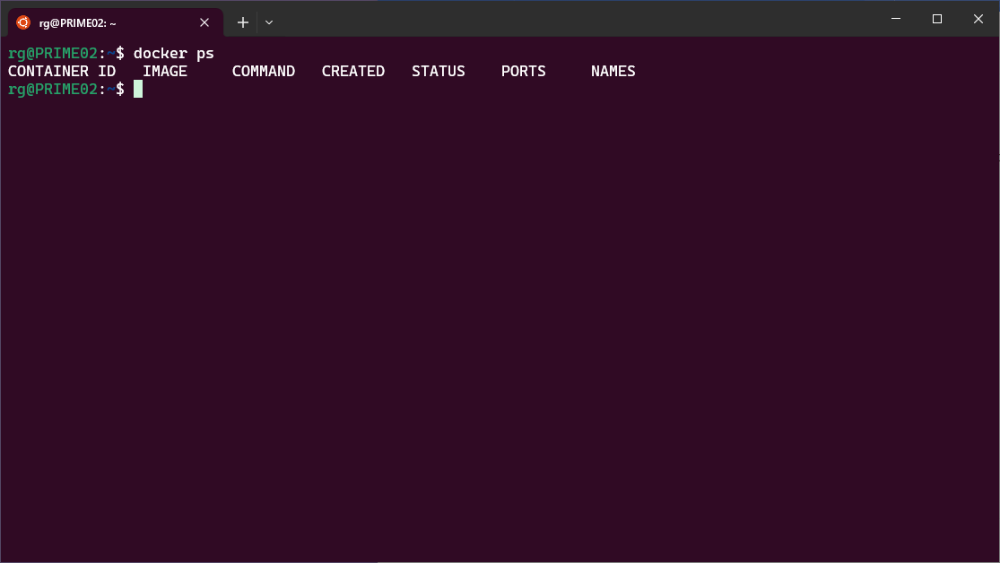

# Windows Subsystem for Linux

Windows Subsystem for Linux (WSL) is a way to run a Linux distribution on a Windows machine without the need for a full VM.

This tutorial walks us through the two options for installing WSL, starting with the graphical option, and then the command line option. We can use which ever one we want.

## Graphical Install

To install WSL via graphical options we need to enable the corresponding Windows feature and choose a Linux distribution from the Microsoft Windows Store.

### Install WSL

On our start menue we can search for "features" to select the "Turn Windows Features on or off".



And scroll down to the "Windows Subsystem for Linux" feature to toggle it on.



After this step we need to **reboot** our machine and install a Linux distribution.

### Install Ubuntu

Next we can open the Windows Store and search for a Linux distribution, in this case Ubuntu.



## Install using Powershell

We can do the same by just using the Powershell.

### Install WSL

To install WSL run the following command on a administrator PowerShell:

```powershell
wsl --install
```

After this step we need to **reboot** our machine and install a Linux distribution.

### Install Ubuntu

Run the following command to install Ubuntu, again from a administrator PowerShell:

```powershell
wsl --install -d Ubuntu
```

## Using WSL / Ubuntu

We can run Ubuntu from our start menu or use the [Windows Terminal Application](https://apps.microsoft.com/detail/9n0dx20hk701?hl=en-US&gl=US).


The first time we use Ubuntu we wil lbe asked for a username and password.



## Using Docker inside WSL / Ubuntu

For our purposes we want to sue Docker inside our Ubuntu instance. First make sure you have the [Docker Desktop App](https://docs.docker.com/desktop/install/windows-install/) installed.

Next we need to set the WSL integration. Open Docker Desktop, click on the settings gear icon, click on "Resources" and "WSL Integration".

Next select the Ubuntu Distribution.


We can check if docker is available on Ubuntu by running `docker ps` on the bash shell.



## Aditional Resources

NetworkChuck's videon on WSL provides, not only the install process, but soem very useful use cases for it.

<iframe width="700" height="405" src="https://www.youtube.com/embed/vxTW22y8zV8?si=c0SM28FWna5hjQCX" title="YouTube video player" frameborder="0" allow="accelerometer; autoplay; clipboard-write; encrypted-media; gyroscope; picture-in-picture; web-share" referrerpolicy="strict-origin-when-cross-origin" allowfullscreen></iframe>

:::tip Adicional Info

- [Install WSL | Microsoft Learn](https://learn.microsoft.com/en-us/windows/wsl/install)
- [Get started using VS Code with WSL | Microsoft Learn](https://learn.microsoft.com/en-us/windows/wsl/tutorials/wsl-vscode)
- [Working across file systems | Microsoft Learn](https://learn.microsoft.com/en-us/windows/wsl/filesystems)
  :::
